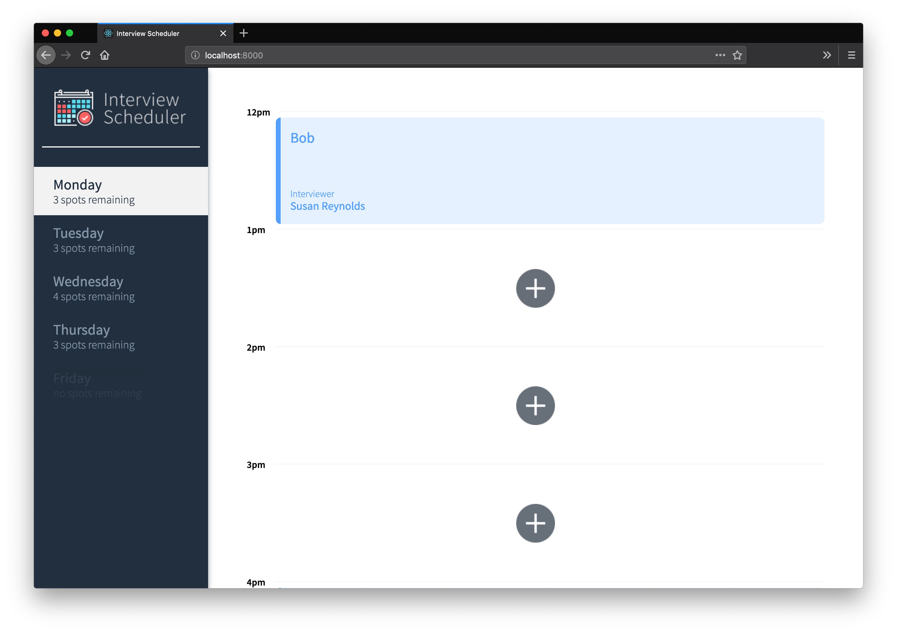
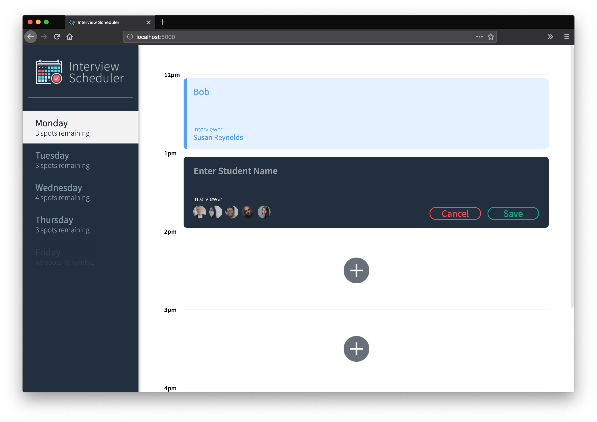
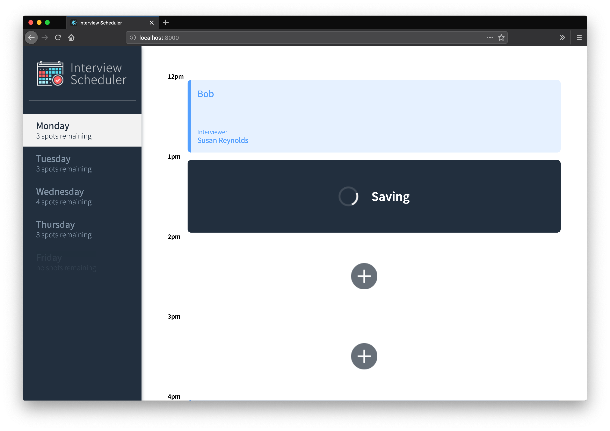
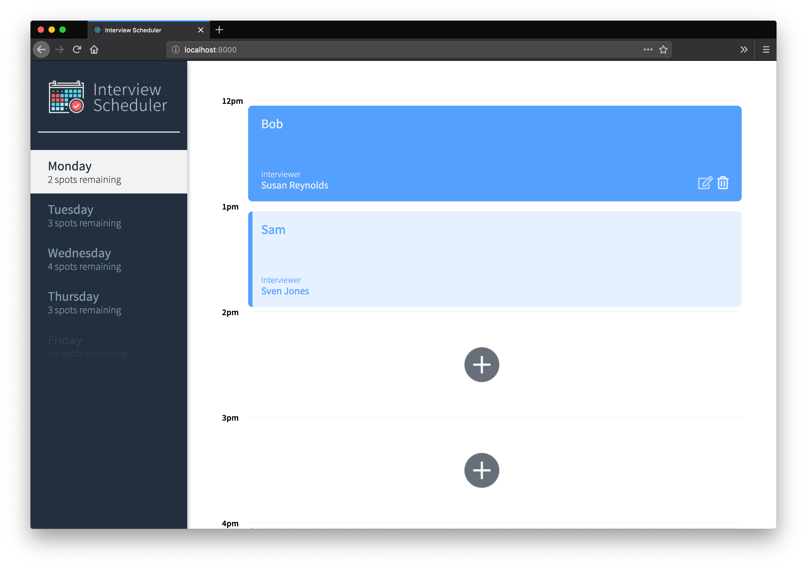
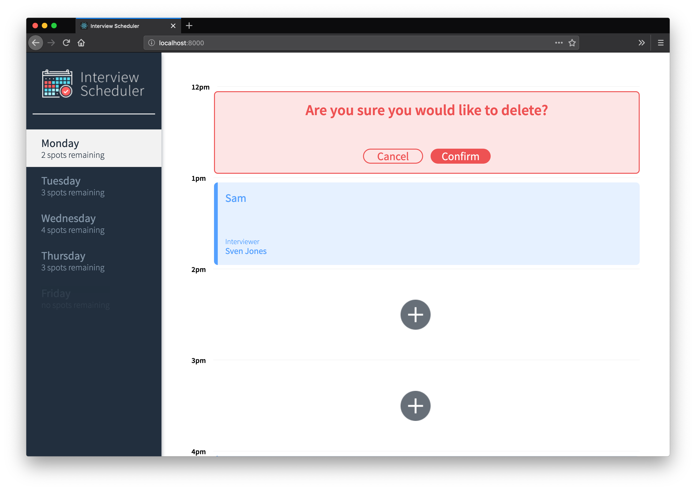
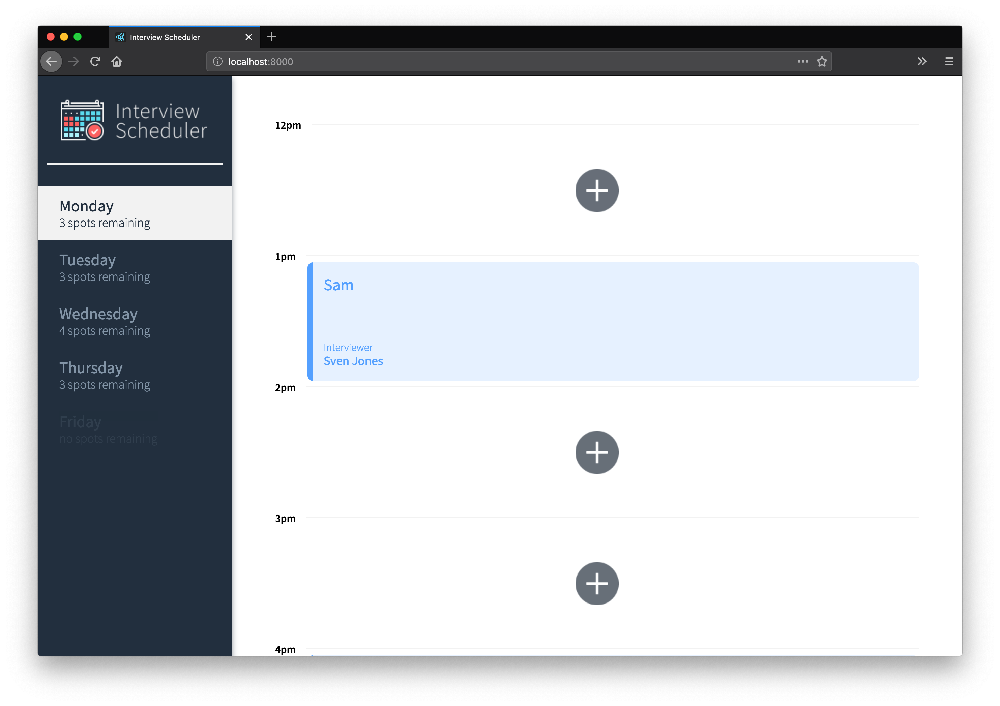
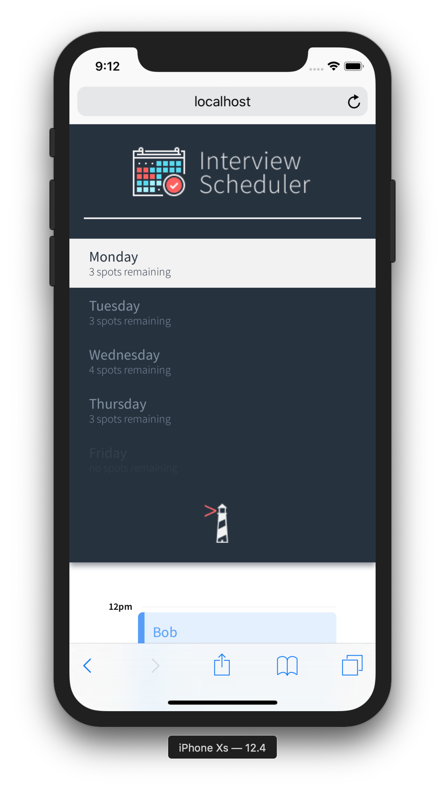
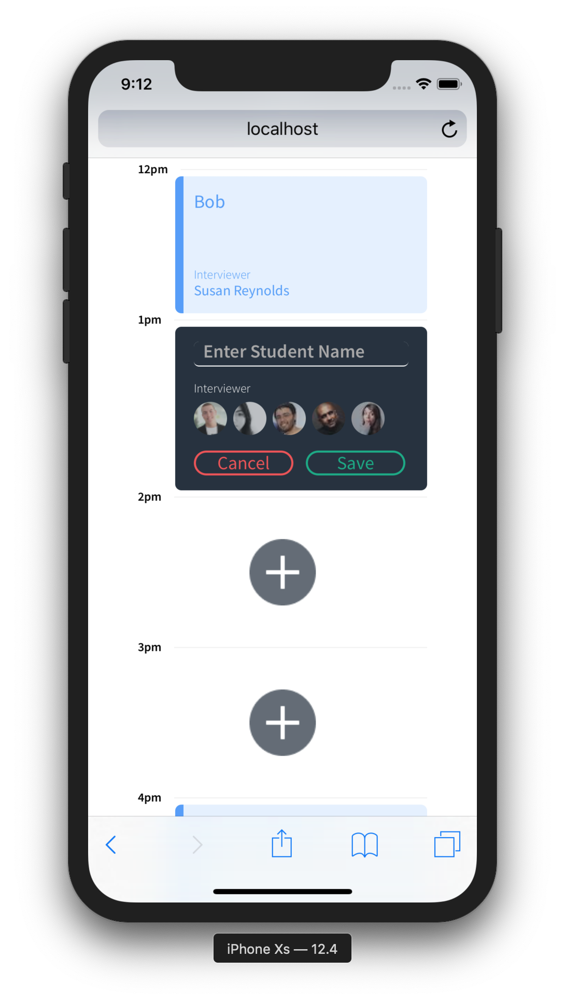

# Interview Scheduler

Interview Scheduler is a [React](https://reactjs.org/) application that allows users to book, edit, and cancel interviews. Data is stored in a PostgreSQL database and updated via requests to an API server. Websockets are also used to enable a realtime experience. Testing methods such as [Storybook](https://storybook.js.org/), [Jest](https://jestjs.io/), and [Cypress](https://www.cypress.io) were used in the development of this app.

Created by Russell McWhae during the Lighthouse Labs Calgary Web Dev Bootcamp in September 2019.

## Screenshots

### Interview Scheduler Home


### Adding a new appointment


### Submitting the new appointment


### Saving the new appointment


### Hovering over an existing appointment


### Deleting an existing appointment


### The appointment has been deleted


### Mobile view


### Adding a new appointment (mobile view)


## Dependencies

* Node.js
* React
* axios
* @testing-library/react-hooks
* react-test-renderer
* PostgreSQL database

### Testing dependencies

* Jest
* Storybook
* Cypress

## Setup

1. Clone this repository.

2. Install dependencies with `npm install`.

3. Clone the [schedular-api](https://github.com/lighthouse-labs/scheduler-api) repository and follow the instructions in its readme to create the PostgreSQL database.

4. Start the `schedular-api` server via `npm start`. It should say `Listening on port 8001 in development mode.`

5. Start the `scheduler` (not the api) with `npm start`. It should say `Compiled successfully!` and open a browser window to [http://localhost:8000]().

## Running Tests

You can run the tests that were used in the development of Interview Schedular to see their output.

### Jest Test Framework

Run `npm test` in the root directory.

### Storybook Visual Testbed

Run `npm run storybook` in the root directory.

### Cypress In-browser Tests

1. Within the `schedular-api` directory, duplicate the `.env.development` file and rename it to `.env.test`. Change only the PGDATABASE value to `scheduler_test`.

2. Create a new `psql` database called `scheduler_test`

3. Run API server in test mode (to ensure the correct database seed) with `NODE_ENV=test npm start`

4. In the Interview Scheduler root directory (not the API), create `crypress.json` with the following:

```json
{
  "baseUrl": "http://localhost:8000",
  "viewportWidth": 1280,
  "viewportHeight": 720
}
```

5. In the Interview Scheduler root directory (not the API), run `npm run cypress`